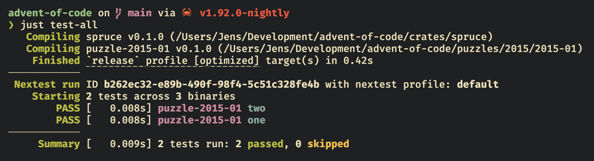
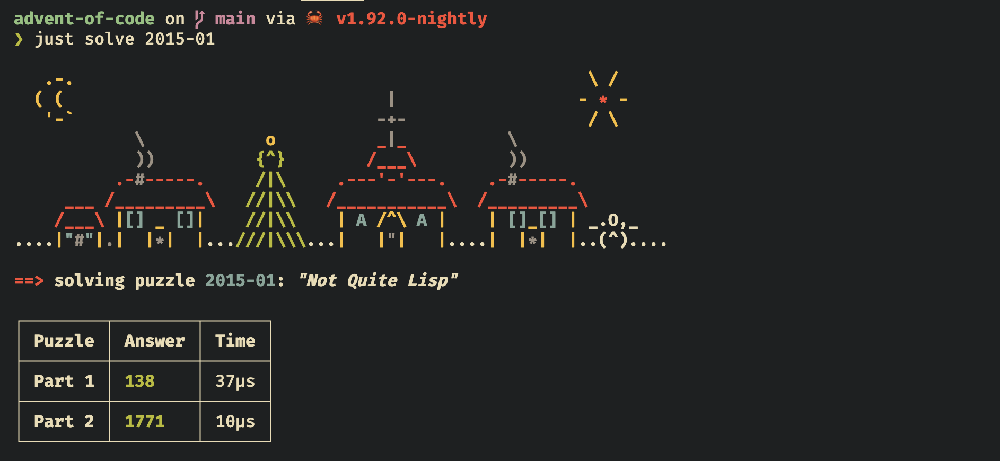

    <h1>🎄 advent-of-code</h1>
    <i>A festive code collection.</i>

 

## Introduction

This repository contains my solutions to the yearly [Advent of Code](https://adventofcode.com/2024/about) calendar of programming puzzles.

Each puzzle is defined as a package under `puzzles/{year}/{year}-{day}`.

- A puzzle package has a library crate (`lib.rs`) containing a test unit for each part of the puzzle. Assertions are made according to the example inputs given on the Advent of Code website's description of the puzzle. Tests can be executed through `just test {year}-{day}` or `just test-all`:

- Each puzzle also has a binary crate (`main.rs`) using my custom `spruce` package (`crates/spruce`), to report the result of running my puzzle input through my solution functions, measuring the time taken.

I have taken the liberty to add several cool ASCII-art banners to the output from `spruce`:

## Puzzles

### 2015

| Day | Puzzle                                 | Part 1 | Part 2 |
| --- | -------------------------------------- | ------ | ------ |
| 1   | Not Quite Lisp                         | ✅     | ✅     |
| 2   | I Was Told There Would Be No Math      | ✅     | ✅     |
| 3   | Perfectly Spherical Houses in a Vacuum | ❌     | ❌     |
| 4   | The Ideal Stocking Stuffer             | ❌     | ❌     |
| 5   | Doesn't He Have Intern-Elves For This? | ❌     | ❌     |
| 6   | Probably a Fire Hazard                 | ❌     | ❌     |
| 7   | Some Assembly Required                 | ❌     | ❌     |
| 8   | Matchsticks                            | ❌     | ❌     |
| 9   | All in a Single Night                  | ❌     | ❌     |
| 10  | Elves Look, Elves Say                  | ❌     | ❌     |
| 11  | Corporate Policy                       | ❌     | ❌     |
| 12  | JSAbacusFramework.io                   | ❌     | ❌     |
| 13  | Knights of the Dinner Table            | ❌     | ❌     |
| 14  | Reindeer Olympics                      | ❌     | ❌     |
| 15  | Science for Hungry People              | ❌     | ❌     |
| 16  | Aunt Sue                               | ❌     | ❌     |
| 17  | No Such Thing as Too Much              | ❌     | ❌     |
| 18  | Like a GIF For Your Yard               | ❌     | ❌     |
| 19  | Medicine for Rudolph                   | ❌     | ❌     |
| 20  | Infinite Elves and Infinite Houses     | ❌     | ❌     |
| 21  | RPG Simulator 20XX                     | ❌     | ❌     |
| 22  | Wizard Simulator 20XX                  | ❌     | ❌     |
| 23  | Opening the Turing Lock                | ❌     | ❌     |
| 24  | It Hangs in the Balance                | ❌     | ❌     |
| 25  | Let It Snow                            | ❌     | ❌     |

### 2016

| Day | Puzzle                                 | Part 1 | Part 2 |
| --- | -------------------------------------- | ------ | ------ |
| 1   | No Time for a Taxicab                  | ✅     | ✅     |
| 2   | Bathroom Security                      | ✅     | ✅     |
| 3   | Squares With Three Sides               | ❌     | ❌     |
| 4   | Security Through Obscurity             | ❌     | ❌     |
| 5   | How About a Nice Game of Chess?        | ❌     | ❌     |
| 6   | Signals and Noise                      | ❌     | ❌     |
| 7   | Internet Protocol Version 7            | ❌     | ❌     |
| 8   | Two-Factor Authentication              | ❌     | ❌     |
| 9   | Explosives in Cyberspace               | ❌     | ❌     |
| 10  | Balance Bots                           | ❌     | ❌     |
| 11  | Radioisotope Thermoelectric Generators | ❌     | ❌     |
| 12  | Leonardo's Monorail                    | ❌     | ❌     |
| 13  | A Maze of Twisty Little Cubicles       | ❌     | ❌     |
| 14  | One-Time Pad                           | ❌     | ❌     |
| 15  | Timing is Everything                   | ❌     | ❌     |
| 16  | Dragon Checksum                        | ❌     | ❌     |
| 17  | Two Steps Forward                      | ❌     | ❌     |
| 18  | Like a Rogue                           | ❌     | ❌     |
| 19  | An Elephant Named Joseph               | ❌     | ❌     |
| 20  | Firewall Rules                         | ❌     | ❌     |
| 21  | Scrambled Letters and Hash             | ❌     | ❌     |
| 22  | Grid Computing                         | ❌     | ❌     |
| 23  | Safe Cracking                          | ❌     | ❌     |
| 24  | Air Duct Spelunking                    | ❌     | ❌     |
| 25  | Clock Signal                           | ❌     | ❌     |

### 2017

| Day | Puzzle                                  | Part 1 | Part 2 |
| --- | --------------------------------------- | ------ | ------ |
| 1   | Inverse Captcha                         | ✅     | ✅     |
| 2   | Corruption Checksum                     | ✅     | ✅     |
| 3   | Spiral Memory                           | ❌     | ❌     |
| 4   | High-Entropy Passphrases                | ❌     | ❌     |
| 5   | A Maze of Twisty Trampolines, All Alike | ❌     | ❌     |
| 6   | Memory Reallocation                     | ❌     | ❌     |
| 7   | Recursive Circus                        | ❌     | ❌     |
| 8   | I Heard You Like Registers              | ❌     | ❌     |
| 9   | Stream Processing                       | ❌     | ❌     |
| 10  | Knot Hash                               | ❌     | ❌     |
| 11  | Hex Ed                                  | ❌     | ❌     |
| 12  | Digital Plumber                         | ❌     | ❌     |
| 13  | Packet Scanners                         | ❌     | ❌     |
| 14  | Disk Defragmentation                    | ❌     | ❌     |
| 15  | Dueling Generators                      | ❌     | ❌     |
| 16  | Permutation Promenade                   | ❌     | ❌     |
| 17  | Spinlock                                | ❌     | ❌     |
| 18  | Duet                                    | ❌     | ❌     |
| 19  | A Series of Tubes                       | ❌     | ❌     |
| 20  | Particle Swarm                          | ❌     | ❌     |
| 21  | Fractal Art                             | ❌     | ❌     |
| 22  | Sporifica Virus                         | ❌     | ❌     |
| 23  | Coprocessor Conflagration               | ❌     | ❌     |
| 24  | Electromagnetic Moat                    | ❌     | ❌     |
| 25  | The Halting Problem                     | ❌     | ❌     |

### 2018

| Day | Puzzle                               | Part 1 | Part 2 |
| --- | ------------------------------------ | ------ | ------ |
| 1   | Chronal Calibration                  | ✅     | ✅     |
| 2   | Inventory Management System          | ✅     | ✅     |
| 3   | No Matter How You Slice It           | ❌     | ❌     |
| 4   | Repose Record                        | ❌     | ❌     |
| 5   | Alchemical Reduction                 | ❌     | ❌     |
| 6   | Chronal Coordinates                  | ❌     | ❌     |
| 7   | The Sum of Its Parts                 | ❌     | ❌     |
| 8   | Memory Maneuver                      | ❌     | ❌     |
| 9   | Marble Mania                         | ❌     | ❌     |
| 10  | The Stars Align                      | ❌     | ❌     |
| 11  | Chronal Charge                       | ❌     | ❌     |
| 12  | Subterranean Sustainability          | ❌     | ❌     |
| 13  | Mine Cart Madness                    | ❌     | ❌     |
| 14  | Chocolate Charts                     | ❌     | ❌     |
| 15  | Beverage Bandits                     | ❌     | ❌     |
| 16  | Chronal Classification               | ❌     | ❌     |
| 17  | Reservoir Research                   | ❌     | ❌     |
| 18  | Settlers of The North Pole           | ❌     | ❌     |
| 19  | Go With The Flow                     | ❌     | ❌     |
| 20  | A Regular Map                        | ❌     | ❌     |
| 21  | Chronal Conversion                   | ❌     | ❌     |
| 22  | Mode Maze                            | ❌     | ❌     |
| 23  | Experimental Emergency Teleportation | ❌     | ❌     |
| 24  | Immune System Simulator 20XX         | ❌     | ❌     |
| 25  | Four-Dimensional Adventure           | ❌     | ❌     |

### 2019

| Day | Puzzle                             | Part 1 | Part 2 |
| --- | ---------------------------------- | ------ | ------ |
| 1   | The Tyranny of the Rocket Equation | ✅     | ✅     |
| 2   | 1202 Program Alarm                 | ✅     | ❌     |
| 3   | Crossed Wires                      | ❌     | ❌     |
| 4   | Secure Container                   | ❌     | ❌     |
| 5   | Sunny with a Chance of Asteroids   | ❌     | ❌     |
| 6   | Universal Orbit Map                | ❌     | ❌     |
| 7   | Amplification Circuit              | ❌     | ❌     |
| 8   | Space Image Format                 | ❌     | ❌     |
| 9   | Sensor Boost                       | ❌     | ❌     |
| 10  | Monitoring Station                 | ❌     | ❌     |
| 11  | Space Police                       | ❌     | ❌     |
| 12  | The N-Body Problem                 | ❌     | ❌     |
| 13  | Care Package                       | ❌     | ❌     |
| 14  | Space Stoichiometry                | ❌     | ❌     |
| 15  | Oxygen System                      | ❌     | ❌     |
| 16  | Flawed Frequency Transmission      | ❌     | ❌     |
| 17  | Set and Forget                     | ❌     | ❌     |
| 18  | Many-Worlds Interpretation         | ❌     | ❌     |
| 19  | Tractor Beam                       | ❌     | ❌     |
| 20  | Donut Maze                         | ❌     | ❌     |
| 21  | Springdroid Adventure              | ❌     | ❌     |
| 22  | Slam Shuffle                       | ❌     | ❌     |
| 23  | Category Six                       | ❌     | ❌     |
| 24  | Planet of Discord                  | ❌     | ❌     |
| 25  | Cryostasis                         | ❌     | ❌     |

### 2020

| Day | Puzzle                  | Part 1 | Part 2 |
| --- | ----------------------- | ------ | ------ |
| 1   | Report Repair           | ❌     | ❌     |
| 2   | Password Philosophy     | ❌     | ❌     |
| 3   | Toboggan Trajectory     | ❌     | ❌     |
| 4   | Passport Processing     | ❌     | ❌     |
| 5   | Binary Boarding         | ❌     | ❌     |
| 6   | Custom Customs          | ❌     | ❌     |
| 7   | Handy Haversacks        | ❌     | ❌     |
| 8   | Handheld Halting        | ❌     | ❌     |
| 9   | Encoding Error          | ❌     | ❌     |
| 10  | Adapter Array           | ❌     | ❌     |
| 11  | Seating System          | ❌     | ❌     |
| 12  | Rain Risk               | ❌     | ❌     |
| 13  | Shuttle Search          | ❌     | ❌     |
| 14  | Docking Data            | ❌     | ❌     |
| 15  | Rambunctious Recitation | ❌     | ❌     |
| 16  | Ticket Translation      | ❌     | ❌     |
| 17  | Conway Cubes            | ❌     | ❌     |
| 18  | Operation Order         | ❌     | ❌     |
| 19  | Monster Messages        | ❌     | ❌     |
| 20  | Jurassic Jigsaw         | ❌     | ❌     |
| 21  | Allergen Assessment     | ❌     | ❌     |
| 22  | Crab Combat             | ❌     | ❌     |
| 23  | Crab Cups               | ❌     | ❌     |
| 24  | Lobby Layout            | ❌     | ❌     |
| 25  | Combo Breaker           | ❌     | ❌     |

### 2021

| Day | Puzzle                  | Part 1 | Part 2 |
| --- | ----------------------- | ------ | ------ |
| 1   | Sonar Sweep             | ❌     | ❌     |
| 2   | Dive!                   | ❌     | ❌     |
| 3   | Binary Diagnostic       | ❌     | ❌     |
| 4   | Giant Squid             | ❌     | ❌     |
| 5   | Hydrothermal Venture    | ❌     | ❌     |
| 6   | Lanternfish             | ❌     | ❌     |
| 7   | The Treachery of Whales | ❌     | ❌     |
| 8   | Seven Segment Search    | ❌     | ❌     |
| 9   | Smoke Basin             | ❌     | ❌     |
| 10  | Syntax Scoring          | ❌     | ❌     |
| 11  | Dumbo Octopus           | ❌     | ❌     |
| 12  | Passage Pathing         | ❌     | ❌     |
| 13  | Transparent Origami     | ❌     | ❌     |
| 14  | Extended Polymerization | ❌     | ❌     |
| 15  | Chiton                  | ❌     | ❌     |
| 16  | Packet Decoder          | ❌     | ❌     |
| 17  | Trick Shot              | ❌     | ❌     |
| 18  | Snailfish               | ❌     | ❌     |
| 19  | Beacon Scanner          | ❌     | ❌     |
| 20  | Trench Map              | ❌     | ❌     |
| 21  | Dirac Dice              | ❌     | ❌     |
| 22  | Reactor Reboot          | ❌     | ❌     |
| 23  | Amphipod                | ❌     | ❌     |
| 24  | Arithmetic Logic Unit   | ❌     | ❌     |
| 25  | Sea Cucumber            | ❌     | ❌     |

### 2022

| Day | Puzzle                   | Part 1 | Part 2 |
| --- | ------------------------ | ------ | ------ |
| 1   | Calorie Counting         | ❌     | ❌     |
| 2   | Rock Paper Scissors      | ❌     | ❌     |
| 3   | Rucksack Reorganization  | ❌     | ❌     |
| 4   | Camp Cleanup             | ❌     | ❌     |
| 5   | Supply Stacks            | ❌     | ❌     |
| 6   | Tuning Trouble           | ❌     | ❌     |
| 7   | No Space Left On Device  | ❌     | ❌     |
| 8   | Treetop Tree House       | ❌     | ❌     |
| 9   | Rope Bridge              | ❌     | ❌     |
| 10  | Cathode-Ray Tube         | ❌     | ❌     |
| 11  | Monkey in the Middle     | ❌     | ❌     |
| 12  | Hill Climbing Algorithm  | ❌     | ❌     |
| 13  | Distress Signal          | ❌     | ❌     |
| 14  | Regolith Reservoir       | ❌     | ❌     |
| 15  | Beacon Exclusion Zone    | ❌     | ❌     |
| 16  | Proboscidea Volcanium    | ❌     | ❌     |
| 17  | Pyroclastic Flow         | ❌     | ❌     |
| 18  | Boiling Boulders         | ❌     | ❌     |
| 19  | Not Enough Minerals      | ❌     | ❌     |
| 20  | Grove Positioning System | ❌     | ❌     |
| 21  | Monkey Math              | ❌     | ❌     |
| 22  | Monkey Map               | ❌     | ❌     |
| 23  | Unstable Diffusion       | ❌     | ❌     |
| 24  | Blizzard Basin           | ❌     | ❌     |
| 25  | Full of Hot Air          | ❌     | ❌     |

### 2023

| Day | Puzzle                          | Part 1 | Part 2 |
| --- | ------------------------------- | ------ | ------ |
| 1   | Trebuchet?!                     | ❌     | ❌     |
| 2   | Cube Conundrum                  | ❌     | ❌     |
| 3   | Gear Ratios                     | ❌     | ❌     |
| 4   | Scratchcards                    | ❌     | ❌     |
| 5   | If You Give A Seed A Fertilizer | ❌     | ❌     |
| 6   | Wait For It                     | ❌     | ❌     |
| 7   | Camel Cards                     | ❌     | ❌     |
| 8   | Haunted Wasteland               | ❌     | ❌     |
| 9   | Mirage Maintenance              | ❌     | ❌     |
| 10  | Pipe Maze                       | ❌     | ❌     |
| 11  | Cosmic Expansion                | ❌     | ❌     |
| 12  | Hot Springs                     | ❌     | ❌     |
| 13  | Point of Incidence              | ❌     | ❌     |
| 14  | Parabolic Reflector Dish        | ❌     | ❌     |
| 15  | Lens Library                    | ❌     | ❌     |
| 16  | The Floor Will Be Lava          | ❌     | ❌     |
| 17  | Clumsy Crucible                 | ❌     | ❌     |
| 18  | Lavaduct Lagoon                 | ❌     | ❌     |
| 19  | Aplenty                         | ❌     | ❌     |
| 20  | Pulse Propagation               | ❌     | ❌     |
| 21  | Step Counter                    | ❌     | ❌     |
| 22  | Sand Slabs                      | ❌     | ❌     |
| 23  | A Long Walk                     | ❌     | ❌     |
| 24  | Never Tell Me The Odds          | ❌     | ❌     |
| 25  | Snowverload                     | ❌     | ❌     |

### 2024

| Day | Puzzle                 | Part 1 | Part 2 |
| --- | ---------------------- | ------ | ------ |
| 1   | Historian Hysteria     | ❌     | ❌     |
| 2   | Red-Nosed Reports      | ❌     | ❌     |
| 3   | Mull It Over           | ❌     | ❌     |
| 4   | Ceres Search           | ❌     | ❌     |
| 5   | Print Queue            | ❌     | ❌     |
| 6   | Guard Gallivant        | ❌     | ❌     |
| 7   | Bridge Repair          | ❌     | ❌     |
| 8   | Resonant Collinearity  | ❌     | ❌     |
| 9   | Disk Fragmenter        | ❌     | ❌     |
| 10  | Hoof It                | ❌     | ❌     |
| 11  | Plutonian Pebbles      | ❌     | ❌     |
| 12  | Garden Groups          | ❌     | ❌     |
| 13  | Claw Contraption       | ❌     | ❌     |
| 14  | Restroom Redoubt       | ❌     | ❌     |
| 15  | Warehouse Woes         | ❌     | ❌     |
| 16  | Reindeer Maze          | ❌     | ❌     |
| 17  | Chronospatial Computer | ❌     | ❌     |
| 18  | RAM Run                | ❌     | ❌     |
| 19  | Linen Layout           | ❌     | ❌     |
| 20  | Race Condition         | ❌     | ❌     |
| 21  | Keypad Conundrum       | ❌     | ❌     |
| 22  | Monkey Market          | ❌     | ❌     |
| 23  | LAN Party              | ❌     | ❌     |
| 24  | Crossed Wires          | ❌     | ❌     |
| 25  | Code Chronicle         | ❌     | ❌     |
